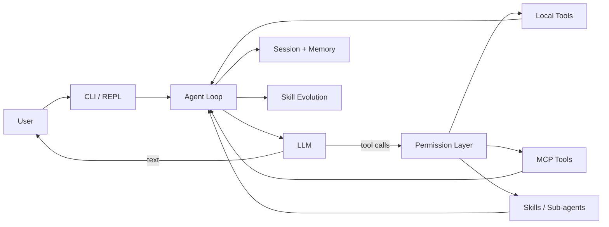

# EvoShell

> A self-evolving coding agent runtime built in Python.

EvoShell is a compact implementation of the runtime behind tools such as Claude Code and Codex. The model decides what to do; EvoShell owns the execution loop: tool dispatch, permission checks, file operations, context management, persistent memory, reusable Skills, MCP integrations, and sub-agents.

The project is designed to answer one question clearly: **what infrastructure is required to turn an LLM into a safe, stateful coding agent?**

## Architecture



The core loop is intentionally explicit:

1. Build the system prompt with project context, Skills, Memory, and available agents.
2. Stream a model response and collect tool calls.
3. Check every call against the active permission mode.
4. Execute safe reads concurrently and state-changing tools sequentially.
5. Append tool results to the conversation and continue until the model returns text.
6. Save the session and evaluate whether reusable feedback should evolve a Skill.

## Highlights

- **Complete agent loop** — supports streaming responses, parallel read tools, retries, budgets, and multi-turn tool execution.
- **OpenAI and Anthropic protocols** — works with official or compatible endpoints.
- **Permission-aware tools** — read, write, exact edit, search, shell, Skills, MCP, and sub-agents.
- **Plan mode** — blocks shell and project writes until a plan is approved.
- **Self-evolving Skills** — extracts durable rules from user feedback, then adds, merges, versions, and evaluates `SKILL.md` files.
- **Persistent context** — project-scoped Memory, resumable sessions, and automatic context compression.
- **MCP without an SDK** — a small stdio JSON-RPC client discovers and routes external tools.
- **Isolated sub-agents** — built-in `explore`, `plan`, and `general` agents run with scoped prompts and tools.

## Quick start

Requirements: Python 3.11+, Git, and optionally Node.js for MCP servers.

```bash
git clone https://github.com/Ian010529/EvoShell.git
cd EvoShell

python3.11 -m venv .venv
source .venv/bin/activate
pip install -r requirements.txt
cp .env.example .env
```

Configure one provider in `.env`:

```env
# OpenAI-compatible
OPENAI_API_KEY=sk-...
OPENAI_BASE_URL=https://api.openai.com/v1
MODEL=gpt-4o
```

```env
# Anthropic-compatible
ANTHROPIC_API_KEY=sk-ant-...
ANTHROPIC_BASE_URL=https://api.anthropic.com
MODEL=claude-sonnet-4-6
```

Start the interactive shell:

```bash
python -m agents.main
```

Or run a single task:

```bash
python -m agents.main "Explain the tool execution loop"
python -m agents.main --plan "Plan a refactor of the permission layer"
python -m agents.main --accept-edits "Fix the failing tests"
```

> [!CAUTION]
> `--yolo` bypasses permission confirmation. Prefer the default mode or `--accept-edits` for normal use.

## Feature walkthrough

Inside the REPL:

```text
/skills          list reusable Skills
/memory          list project-scoped memories
/plan            toggle read-only planning
/compact         compact the current context
/cost            show token and cost estimates
/skill-stats     inspect Skill usage and evolution
/skill-eval      evaluate evolved Skills
```

To observe the full tool loop, ask:

```text
Read agents/main.py and agents/agent.py, then explain how user input reaches the tool loop.
```

To exercise Skill evolution, start with automatic edits enabled:

```bash
EVOSHELL_AUTO_SKILL_EVOLUTION=1 \
EVOSHELL_AUTO_SKILL_TARGET=project \
python -m agents.main --accept-edits
```

Give a task, then provide an explicit reusable correction in the next turn. EvoShell will classify it as `add`, `merge`, or `discard` and persist accepted changes under `.bear/skills/`.

## Source map

| File | Responsibility |
| --- | --- |
| `agents/main.py` | CLI arguments, REPL commands, session restore |
| `agents/agent.py` | Model clients, agent loop, tool dispatch, compression |
| `agents/tools.py` | Tool schemas, implementations, permission policy |
| `agents/prompt.py` | Dynamic system prompt and project instructions |
| `agents/skills.py` | Skill discovery, retrieval, invocation, creation |
| `agents/online_skill_evolution.py` | Feedback extraction and add/merge/discard decisions |
| `agents/skill_evolution.py` | Skill versioning, provenance, usage statistics |
| `agents/online_skill_eval.py` | Replay-based evaluation and promotion |
| `agents/memory.py` | Persistent project memory and semantic retrieval |
| `agents/mcp_client.py` | MCP stdio JSON-RPC client and tool routing |
| `agents/subagent.py` | Built-in and custom sub-agent definitions |
| `agents/session.py` | Conversation persistence and resume |

For a first source-code pass, read `main.py → agent.py → tools.py → skills.py`. That path covers the runtime before the optional subsystems.

## Runtime data

| Data | Location |
| --- | --- |
| Project Skills | `.bear/skills/<name>/SKILL.md` |
| Skill evolution audit | `.bear/skill-evolution/` |
| Long-term Memory | `~/.BearCode/projects/<project_hash>/memory/` |
| Sessions | `~/.bear-code/sessions/` |
| Large tool results | `~/.bear-code/tool-results/` |
| Plans | `~/.bear/plans/` |

These legacy storage paths are retained so existing local sessions and memories remain compatible after the rename to EvoShell.
